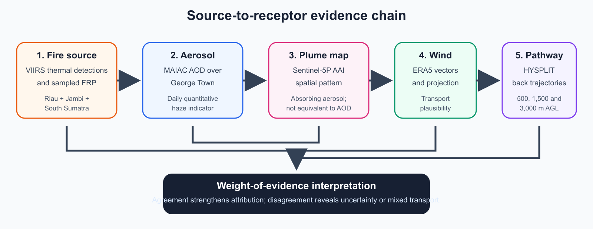
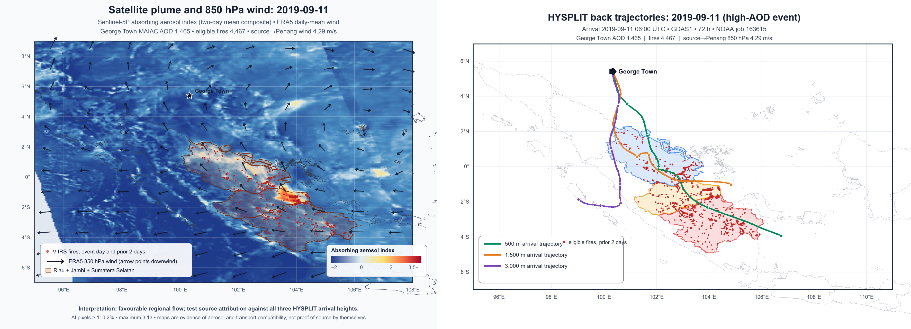
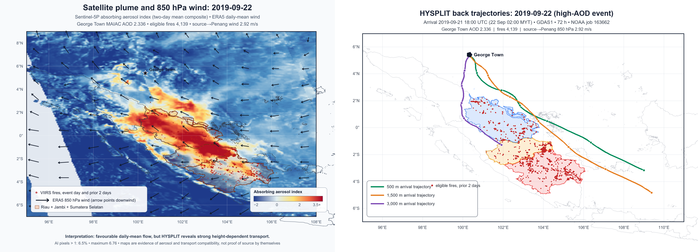
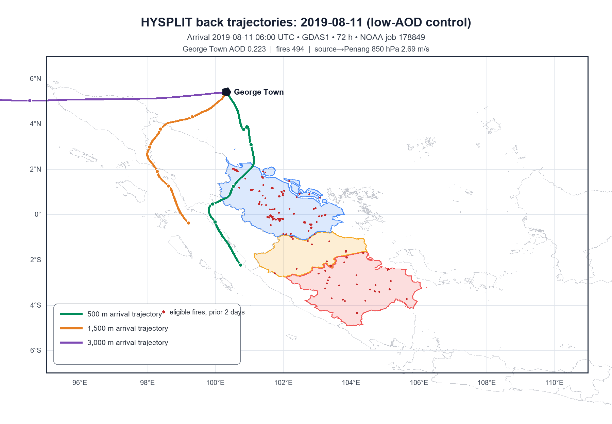

# Satellite Investigation of Transboundary Haze Transport from Sumatran Fires to George Town, Penang

**Author:** Avelyn Lim Xing Rui  
**Publication version:** 1.0.0 (20 September 2026)  
**DOI:** [10.5281/zenodo.22858814](https://doi.org/10.5281/zenodo.22858814)  
**Project type:** Independent A-level research project  

**Study period:** 1 August-30 September 2019  
**Target location:** George Town, Penang, Malaysia  
**Source region:** Riau, Jambi, and South Sumatra, Indonesia  
**Student level:** A-level  

## Abstract

This project investigated whether increased aerosol loading over George Town during the September 2019 Southeast Asian haze episode was consistent with transport from land and vegetation fires in Sumatra. Daily VIIRS active-fire detections in Riau, Jambi, and South Sumatra were joined with MODIS MAIAC mean aerosol optical depth (AOD), Sentinel-5P Absorbing Aerosol Index (AAI), and ERA5 winds. Pearson and Spearman correlations were calculated at lags of zero to three days. Two high-AOD events, 11 and 22 September, were then examined using two-day mean AAI plume maps, 850 hPa wind vectors, and 72-hour NOAA HYSPLIT back trajectories arriving over George Town at 500, 1,500, and 3,000 m above ground level.

Fire detections were strongly associated with George Town AOD on the same day (Pearson *r* = 0.821; Spearman *rho* = 0.584; *n* = 27) and one day later (*r* = 0.816; *rho* = 0.705; *n* = 27). The one-day association remained strong on days when both source-region and Penang 850 hPa winds had a component toward George Town (*r* = 0.812; *rho* = 0.731; *n* = 20). Independent ground context strengthened the interpretation: daily mean API across four Penang stations was strongly associated with available MAIAC AOD (*r* = 0.871; *rho* = 0.795; *n* = 27). The 11 September event produced the strongest convergent attribution evidence: high fire activity, high AOD, elevated ground API, favourable winds, and all three HYSPLIT arrival heights intersected the refined Sumatra source region. The 22 September case was more complex. A strong absorbing-aerosol plume was present over Sumatra, but only the 3,000 m trajectory crossed Riau and Jambi; the lower trajectories arrived from the east or southeast. The results support a Sumatran influence on the 2019 Penang haze while showing that transport varied with height and time. They do not prove that every aerosol observed over George Town originated from Sumatra.

## 1. Introduction

Seasonal land and vegetation fires in Indonesia can release large quantities of smoke into the atmosphere. Under suitable meteorological conditions, the smoke can cross the Strait of Malacca and affect Peninsular Malaysia. George Town is a useful receptor location because of its position on the northwest coast of Peninsular Malaysia and its exposure to regional transport from Sumatra.

Satellite observations allow different stages of this source-to-receptor process to be studied. Thermal-infrared observations identify active-fire detections, aerosol optical depth measures the total extinction of light through the atmospheric column, and ultraviolet aerosol indices help locate absorbing aerosol such as smoke. Reanalysis winds and air-parcel trajectories then test whether transport between the potential source and receptor was physically plausible.

No single dataset establishes causation. A satellite hotspot does not prove crop burning or identify who started a fire. AOD does not identify aerosol origin and is not equivalent to surface PM2.5. A favourable wind direction does not prove that smoke was carried along that route. This study therefore uses a weight-of-evidence design in which source activity, receptor aerosol, regional circulation, and back trajectories are evaluated together.

## 2. Research question and hypotheses

### Research question

To what extent was increased aerosol loading over George Town during September 2019 associated with fire activity in Sumatra and winds blowing toward Peninsular Malaysia?

### Hypotheses

- **H1:** More active-fire detections in central and southern Sumatra will be associated with higher AOD over George Town.
- **H2:** The association will be strongest after a lag of approximately one or two days.
- **H3:** High-AOD conditions will be most convincing when winds and back trajectories are compatible with transport from Sumatra.
- **H0:** There is no meaningful association between Sumatran fire activity and aerosol conditions over George Town.

## 3. Data and methods

*Figure 1. Source-to-receptor evidence chain used in this project. Agreement among independent measurements strengthens attribution; disagreement identifies uncertainty or mixed transport.*

### 3.1 Study regions and period

The analysis covered every day from 1 August to 30 September 2019. The receptor was a 25 km buffer around central George Town, approximately 5.414°N, 100.329°E. The primary source region was the administrative union of Riau, Jambi, and South Sumatra. These provinces captured the principal Sumatran fire areas relevant to the episode while providing a reproducible alternative to an arbitrary rectangular boundary. A previous latitude-longitude box was retained as a sensitivity dataset.

### 3.2 VIIRS active-fire observations

NASA FIRMS VIIRS 375 m detections were used as observations of sampled thermal anomalies (NASA FIRMS, 2026). The primary fire indicator included presumed vegetation fires with nominal or high confidence. Daily detection count and sampled fire radiative power (FRP) were calculated. FRP is an instantaneous measure at the satellite overpass, so its daily sum was not interpreted as total daily fire energy. The polar-orbiting sensor also samples only particular times of day and can miss parts of the fire diurnal cycle (Li, 2018; Waigl, 2017).

### 3.3 MAIAC aerosol optical depth

MODIS MAIAC MCD19A2 Version 6.1 AOD at 0.55 micrometres was extracted over the George Town buffer using Google Earth Engine (Google Earth Engine, 2026a). The strict quality mask retained 27 valid days and left 34 days missing. Missing retrievals were not converted to zero. Daily **mean AOD** was designated as the primary statistical outcome because it had already been used in the joined analysis; daily median AOD was retained as a sensitivity test. AOD measures total column light extinction by scattering and absorbing aerosol; it is not a direct measurement of surface particulate concentration.

### 3.4 Sentinel-5P Absorbing Aerosol Index

Sentinel-5P Offline Level-3 AAI was used primarily for spatial plume mapping (Google Earth Engine, 2026b). AAI is sensitive to a particular ultraviolet-absorbing aerosol signal and is physically different from AOD. Two-day **mean composites**, 10-11 September and 21-22 September, reduced individual-orbit gaps for the event maps. A consistent colour scale was used so the events could be compared visually.

### 3.5 ERA5 winds and transport component

Hourly ERA5 10 m and 850 hPa wind components were averaged by day over the source region and George Town (Google Earth Engine, 2026c). For each day, the source-to-receptor direction was calculated from the eligible-fire centroid to George Town. The wind vector was projected onto this route. A positive projection indicates a component toward George Town. A favourable-transport flag required positive 850 hPa projections at both the source and receptor. In the primary lagged analysis, this flag was evaluated on the **fire-observation day**. Additional sensitivity tests evaluated it on the AOD/receptor day and required favourable conditions throughout the complete lag window.

### 3.6 Penang ground observations

Monthly station-level PM2.5 and PM10 concentrations were taken from an official DOSM publication whose underlying source is the Malaysian Department of Environment (Department of Statistics Malaysia, 2021). Event-scale observations came from a public research archive reconstructed from the DOE Air Pollutant Index Management System (APIMS) (Young Shung, 2022). The archive contains hourly API for Balik Pulau, Minden, Seberang Jaya, and Seberang Perai throughout the study period. All 1,464 hourly timestamps were present; 18 of 5,856 station-hour values were missing, all at Minden on 24-25 September, leaving 99.7% completeness.

API was retained as an index and was not converted into PM2.5. DOE calculates pollutant sub-indices using pollutant-specific averaging periods and reports the maximum sub-index as API (Department of Environment Malaysia, 2021). For daily comparison, the available hourly API values were averaged across the four stations, and the daily maximum and number of station-hours at or above API 101 were also retained. The third-party archive was checked against published 11 and 18 September readings; the values agreed, including the four station readings at 09:00 on 18 September and the official episode maxima later that day. This cross-check supports transcription integrity but does not turn the archive into an official DOE distribution.

### 3.7 Correlation and lag analysis

Eligible fire count and sampled FRP were compared with MAIAC mean AOD and Penang mean AAI at lags of zero, one, two, and three days. Pearson correlation measured linear association, while Spearman rank correlation measured monotonic association and reduced sensitivity to the precise size of extreme observations. Every planned lag was reported. Only available observation pairs were used; no missing AOD values were imputed. Sensitivity checks compared mean with median AOD, August with September, fire-day with receptor-day wind screening, and the original series with linearly detrended values. Lag-one autocorrelations were also calculated to identify serial dependence. These diagnostics do not convert the exploratory correlations into causal or fully independent statistical tests.

### 3.8 Event maps and HYSPLIT trajectories

The two highest valid mean-AOD dates, 11 and 22 September, were selected for event analysis. Sentinel-5P AAI, VIIRS detections, source-province boundaries, and daily ERA5 850 hPa vectors were plotted on a common map. Because these products represent different overpasses or averaging windows, each figure is an **event-period comparison**, not a simultaneous atmospheric snapshot. An 11 August low-AOD control was then selected before inspecting its trajectory. It had mean AOD 0.223, favourable 850 hPa transport, and enough time after the start of a single GDAS1 weekly file to support the same 72-hour calculation. This made it a more informative control than a date with unfavourable winds.

NOAA READY HYSPLIT was used to calculate 72-hour back trajectories arriving over George Town at 500, 1,500, and 3,000 m above ground level (Stein et al., 2015; Rolph et al., 2017). The runs used archived GDAS1 1° meteorology and model vertical velocity. The 11 August control and 11 September event arrived at 06:00 UTC. The second event trajectory arrived at 18:00 UTC on 21 September, equivalent to 02:00 Malaysian time on 22 September, because the weekly meteorological archive boundary prevented a later 72-hour run using one file. Each hourly endpoint was tested for intersection with Riau, Jambi, and South Sumatra. A 27-member HYSPLIT meteorological ensemble was also run for the mixed 22 September case at 1,500 m. Ensemble members perturb the meteorological grid in the horizontal and vertical and therefore show path sensitivity; their fraction is not a calibrated source probability. The 22 September result represents an early-morning arrival and is not directly simultaneous with the daytime satellite observations.

## 4. Results

### 4.1 Fire activity

The refined source dataset contained 64,868 nominal- or high-confidence presumed vegetation-fire detections. There were 14,785 eligible detections in August and 50,083 in September. The largest daily count was 4,467 on 11 September. September fire detections were distributed across Riau, Jambi, and South Sumatra, with Jambi and South Sumatra showing especially large increases relative to August.

### 4.2 Ground-level observations

Official monthly observations provide supporting context but are too coarse for the daily lag analysis (Department of Statistics Malaysia, 2021, p. 57). September 2019 mean PM2.5 was 54.19 µg/m³ at Balik Pulau, 39.08 at Perai, 44.01 at Seberang Jaya, and 49.52 at USM. At all four sites, September was the highest monthly PM2.5 value reported for 2019. These measurements support the selection of September as a haze case study but do not independently identify the aerosol source.

The hourly API archive fills the event-scale timing gap. The table below averages all available station-hour API values for each selected day; it is a descriptive index summary, not a pollutant concentration.

| Date | Role | Four-station station-hour mean API | Highest hourly API | Station-hours at API 101 or above |
|---|---|---:|---:|---:|
| 11 August | Low-AOD control | 52.2 | 70 | 0 of 96 |
| 11 September | Strong transport event | 93.1 | 128 | 27 of 96 |
| 18 September | Most severe ground episode | 182.3 | 263 | 94 of 96 |
| 22 September | Mixed transport event | 126.7 | 176 | 77 of 96 |
| 24 September | Post-episode decline | 82.2 | 100 | 0 of 78 valid values |

Across the 27 days with valid MAIAC AOD, the four-station daily mean API had Pearson *r* = 0.871 and Spearman *rho* = 0.795 with AOD. This strong positive agreement provides useful ground-level validation that high column aerosol loading generally coincided with worse reported air quality. It does not mean AOD and API measure the same quantity: AOD measures the atmospheric column, whereas API is the maximum of pollutant sub-indices based on rolling concentration averages. The API series is also temporally smoothed, so the correlation is descriptive rather than a fully independent validation test.

### 4.3 Fire-AOD relationships

*Table 1. Associations between eligible fire detections and George Town mean MAIAC AOD. The favourable-wind subset evaluates the wind flag on the fire-observation day.*

| Lag after fire observation | Pairs | Pearson *r* | Spearman *rho* | Spearman *rho*, favourable 850 hPa transport |
|---:|---:|---:|---:|---:|
| 0 days | 27 | 0.821 | 0.584 | 0.560 (*n* = 21) |
| 1 day | 27 | 0.816 | 0.705 | 0.731 (*n* = 20) |
| 2 days | 26 | 0.646 | 0.569 | 0.496 (*n* = 18) |
| 3 days | 25 | 0.401 | 0.513 | 0.539 (*n* = 17) |

The largest Pearson coefficient occurred at lag zero, while the largest Spearman coefficient occurred at lag one. This is consistent with a rapid regional relationship in which the exact delay varies among events and observations. The coefficients weakened at lags two and three. Because only 27 days had valid AOD and the days form a short time series, the results are exploratory rather than a formal causal estimate.

Sampled FRP produced a similar pattern. Its same-day Pearson correlation with AOD was 0.820, while the largest all-day Spearman correlation was 0.668 at lag two. This difference illustrates why hotspot count and sampled FRP should be treated as related but non-identical indicators.

### 4.4 Sensitivity and serial-dependence checks

Mean-versus-median choice had little effect on the central result. At lag zero, Pearson *r* was 0.821 using mean AOD and 0.821 using median AOD; the corresponding Spearman coefficients were 0.584 and 0.565. At lag one, Pearson *r* was 0.816 for both statistics, while Spearman *rho* was 0.705 for mean AOD and 0.676 for median AOD.

The association was strongly concentrated in the September event regime. For same-day fire count and mean AOD, August produced Pearson *r* = 0.042 and Spearman *rho* = 0.238 (*n* = 12), whereas September produced *r* = 0.816 and *rho* = 0.625 (*n* = 15). This does not invalidate the event result, but it means the full-period correlation should not be interpreted as a stable relationship across both months.

A simple linear detrending check remained strong: detrended same-day Pearson *r* was 0.806 and detrended one-day *r* was 0.788. Wind-timing sensitivity was also reasonably stable at one day. Spearman *rho* was 0.731 when favourable transport was required on the fire day, 0.709 when required on the receptor day, and 0.711 when required throughout both days. At longer lags the complete-window subsets became small; by lag three only 10 pairs remained and Spearman *rho* fell to 0.164.

Serial dependence was substantial. Eligible fire detections had a lag-one Pearson autocorrelation of 0.719 across 60 adjacent days. Mean AOD had a lag-one correlation of 0.510 across the 16 adjacent day-pairs with valid retrievals. The nominal sample sizes therefore overstate the number of fully independent observations. These results are recorded in `data/processed/penang_sumatra_sensitivity_checks_2019.csv` and support cautious, event-focused interpretation rather than formal causal inference.

### 4.5 Daily mean AAI relationships

Penang daily mean AAI had almost no relationship with fire count at lag zero (Pearson *r* = 0.031; Spearman *rho* = -0.028; *n* = 61). This does not disprove a smoke influence. AAI responds to UV absorption, aerosol altitude, clouds, and surface conditions rather than simply measuring total aerosol amount. The result supports using AAI as spatial plume evidence rather than as the main scalar haze outcome.

### 4.6 Event case: 11 September 2019

*Figure 2. Two-day mean Sentinel-5P AAI and daily-mean ERA5 850 hPa winds (left), paired with 72-hour HYSPLIT back trajectories arriving over George Town on 11 September (right). The layers support an event-period interpretation and are not simultaneous measurements.*

On 11 September, George Town MAIAC AOD was 1.465, the source region contained 4,467 eligible fire detections, and the source-region 850 hPa wind projection toward Penang was +4.29 m/s. Ground observations were also elevated: the four-station station-hour mean API was 93.1, Balik Pulau reached 128, and 27 of 96 station-hours were at API 101 or above. The trajectory results were strongly convergent:

- The 500 m trajectory contained 28 hourly endpoints in Riau, 8 in Jambi, and 10 in South Sumatra.
- The 1,500 m trajectory contained 43 endpoints in Riau and 3 in Jambi.
- The 3,000 m trajectory contained 5 endpoints in Riau.

All three arrival heights therefore crossed the refined source region. Together, the source activity, high receptor AOD, favourable circulation, and trajectory intersections make 11 September the strongest Sumatran transport case in this analysis.

### 4.7 Event case: 22 September 2019

*Figure 3. Two-day mean Sentinel-5P AAI and daily-mean ERA5 850 hPa winds (left), paired with HYSPLIT trajectories arriving at 02:00 MYT on 22 September (right). The early-morning trajectory is not simultaneous with the daytime satellite measurements.*

On 22 September, George Town AOD reached 2.336, the highest valid value in the study period. There were 4,139 eligible fire detections, and the source-region 850 hPa projection toward Penang was +2.92 m/s. The four-station station-hour mean API was 126.7, the daily maximum was 176, and 77 of 96 station-hours were at API 101 or above. Sentinel-5P showed a strong absorbing-aerosol plume over central and southern Sumatra: 6.5% of mapped pixels exceeded AAI 1 and the maximum was 6.76.

The trajectories revealed a more complicated situation. Neither the 500 m nor 1,500 m trajectory centreline intersected the three source provinces; both approached George Town from the east or southeast. The 3,000 m path contained 8 endpoints in Riau and 1 in Jambi. The event therefore provides more direct evidence of a Sumatran pathway at high altitude than at the two lower arrival levels.

The 1,500 m meteorological ensemble showed that this central-path result was sensitive to plausible perturbations of the driving meteorology. Sixteen of 27 members (59%) intersected at least one selected source province: 16 members crossed Riau, 14 crossed Jambi, and 10 crossed South Sumatra, with several members crossing more than one province. Thus, “the central 1,500 m path did not intersect Sumatra” is accurate, but “a Sumatran pathway at 1,500 m was implausible” is not supported. The ensemble does not prove that those members carried smoke; it demonstrates substantial trajectory uncertainty and a credible family of Sumatran pathways.

However, the absence of a direct province intersection must not be interpreted as proof that the lower air parcels contained no Sumatran smoke. A HYSPLIT trajectory is an estimated parcel centreline rather than the boundary of an air mass or aerosol plume. Smoke could have left Sumatra earlier, dispersed into the surrounding atmosphere, and subsequently mixed into air arriving along the lower trajectories. Horizontal turbulent dispersion can make a smoke plume much wider than a plotted trajectory line, while vertical mixing or subsidence can transfer aerosol from an elevated Sumatran layer into lower levels. The three-province source boundary also excludes fires elsewhere in Sumatra and nearby islands, and the coarse meteorological data and selected arrival time introduce additional uncertainty. Consequently, attribution at 500 and 1,500 m remains possible but indirect and uncertain; testing it properly would require trajectory ensembles or a dispersion simulation rather than three single centreline trajectories.

### 4.8 Low-AOD control: 11 August 2019

*Figure 4. Seventy-two-hour HYSPLIT back trajectories for the low-AOD control, arriving over George Town at 06:00 UTC on 11 August. The control uses the same three arrival heights and model settings as the event trajectories.*

On 11 August, George Town mean AOD was 0.223, the source region contained 494 eligible fire detections, and both source-region and Penang 850 hPa projections were favourable. The four-station station-hour mean API was 52.2, the maximum was 70, and no station-hour reached 101. The 500 m trajectory crossed Riau between approximately 30 and 42 hours before arrival, but the 1,500 and 3,000 m trajectories did not intersect any of the three source provinces. Despite some transport compatibility, both AOD and surface API remained low. Compared with 11 September, the source fire count was about nine times smaller and AOD was about 6.6 times smaller.

The control shows why a trajectory intersection or favourable wind direction is not sufficient by itself to produce severe haze. Aerosol loading also depends on emission strength, plume width, removal, vertical mixing, and the fraction of transported smoke that reaches the receptor. Conversely, the single low-level intersection means the control is not a perfectly “unexposed” atmosphere. It is best interpreted as a low-aerosol comparison that tests the sufficiency of transport evidence, not as proof that no Sumatran material was present.

### 4.9 Why George Town appears blue on the AAI maps

The event-map header reports daily mean MAIAC AOD, whereas the coloured map background shows a two-day mean Sentinel-5P AAI composite. George Town can therefore have high AOD and negative, blue AAI at the same time. The daily Penang summaries were AOD 1.465 and AAI -1.699 on 11 September, and AOD 2.336 and AAI -1.122 on 22 September. These one-day AAI summaries help explain the local sign but are not numerically identical to the two-day map composites. Negative AAI does not mean zero aerosol or clean air.

Smoke reaching Penang may have aged, diluted, or mixed with humid, strongly scattering particles. It may also have been concentrated relatively low in the atmosphere, where AAI is less sensitive than it is to an elevated absorbing layer. MAIAC and Sentinel-5P have different overpass sampling and spatial resolutions, and Sentinel-5P's coarser pixels smooth fine plume structure. Clouds, surface reflectance, and retrieval conditions can also affect AAI. The red source-region plume and blue George Town surroundings are therefore not inherently contradictory.

## 5. Discussion

### 5.1 Evaluation of the hypotheses

H1 is supported as an exploratory association: days with more source-region fire detections generally had higher available George Town AOD. H2 is partly supported. Pearson correlation was marginally largest on the same day, while Spearman correlation was largest at a one-day lag. The data therefore support a short delay of approximately zero to one day more clearly than a fixed one- or two-day delay.

H3 is supported for the strongest event but requires qualification. Favourable ERA5 winds and HYSPLIT pathways strengthened the 11 September interpretation. The 22 September case showed why daily mean circulation cannot substitute for trajectories: the mean wind suggested transport plausibility, but the lower-level trajectory centrelines came from another direction. The 11 August control further showed that favourable flow and even one source-region intersection can coexist with low AOD when fire activity is much lower. This weakens simplistic attribution based on direction alone without excluding smoke that had already dispersed away from Sumatra or mixed vertically from an elevated layer. The evidence is consequently inconsistent with the simplest version of H0, but the project does not establish causation or exclude other sources.

### 5.2 Value of combining independent evidence

The main strength of the project is that it does not rely on one correlation or one satellite image. VIIRS identifies when and where intense fire activity was sampled. MAIAC provides a quantitative receptor aerosol measure. Sentinel-5P shows the spatial distribution of UV-absorbing aerosol. ERA5 provides a continuous regional circulation field, and HYSPLIT estimates time-varying, height-specific air-parcel pathways. Agreement among these layers produces a stronger interpretation than any individual dataset.

The contrast between the two selected events is especially informative. Retaining the mixed 22 September result avoids selecting only the map that supports the preferred explanation. It suggests that the haze atmosphere was vertically layered and may have contained contributions from different pathways, locations, or times.

### 5.3 Interpretation of AOD and AAI

AOD and AAI should not be described interchangeably. High AOD indicates strong total aerosol extinction, while positive AAI indicates a strong UV-absorbing signature under the retrieval conditions. Aerosol ageing, humidity, vertical position, cloud, surface reflectance, and sensor sampling can cause the two products to behave differently. This explains why daily mean Penang AAI correlations were weak even though the spatial product clearly detected absorbing aerosol over the source region on 22 September.

### 5.4 Limitations

1. VIIRS detections are satellite samples, not a complete count of individual fires or burned area. Overpass time, cloud, fire intensity, and viewing geometry affect detection.
2. Summed FRP represents sampled instantaneous radiative power and not total daily energy.
3. Only 27 of 61 days contained valid quality-screened MAIAC AOD. Missingness may be related to cloud or dense haze and is not necessarily random.
4. AOD measures the atmospheric column rather than surface PM2.5. The hourly API archive provides event-scale ground context, but API is a rolling, composite health index rather than a PM2.5 concentration and its daily mean is an additional descriptive aggregation.
5. The hourly archive was reconstructed by a third party from DOE APIMS rather than downloaded from a current official historical endpoint. Its event readings match published government and news reports, but formal DOE-supplied concentration data would have stronger provenance.
6. ERA5 represents regional-scale circulation and cannot reproduce street-level flow around George Town.
7. A trajectory is a modelled parcel centreline, not a direct observation of smoke or the full width of an air mass. It is sensitive to meteorological resolution, start time, height, and vertical-motion assumptions, and a path that misses the source boundary may still pass through previously dispersed or vertically mixed smoke.
8. Two high-AOD event dates and one low-AOD control were tested, with one arrival time per date. The 22 September trajectory represents 02:00 MYT rather than the complete day, while its AAI layer averages 21-22 September and its ERA5 layer averages 22 September. The ensemble tests meteorological sensitivity only at 1,500 m and must not be interpreted as a source probability.
9. Local Malaysian fires, shipping, industry, traffic, sea salt, and aerosol arriving from other regions remain possible contributors.
10. Correlation does not establish causation, and serial dependence in daily observations reduces the effective amount of independent information.
11. Fire assignment and trajectory intersection use a 2025 Indonesian province boundary, while Earth Engine wind averaging uses GAUL 2015. The provincial definitions are broadly compatible but not geometrically identical.
12. The Earth Engine GeoTIFFs use pixel-aligned extents that extend slightly beyond the requested map box. Their embedded transforms, EPSG:4326 CRS, requested-area coverage, and band descriptions were verified programmatically; the renderer now positions pixels and wind vectors from those metadata. This removes the earlier alignment assumption but does not remove the native spatial-resolution limits of Sentinel-5P and ERA5.
13. Event dates were selected because they were the two highest valid mean-AOD days. They are informative peak cases but not an unbiased sample of all transport conditions.

## 6. Conclusion

The September 2019 data are consistent with an important Sumatran fire influence on aerosol conditions over George Town. Fire counts and sampled FRP increased sharply during September, while available George Town mean AOD was strongly associated with fire activity on the same day and one day later. The association was concentrated in September, remained strong after simple linear detrending, and was similar when median AOD or alternative wind-timing definitions were used. Ground observations independently showed that available AOD covaried strongly with daily mean API and that the two selected September events had elevated or unhealthy station readings, while the 11 August control did not. Serial dependence, API smoothing, and the small valid-AOD sample nevertheless prevent the coefficients from being treated as fully independent causal estimates. The 11 September event provided the clearest source-to-receptor evidence because all three HYSPLIT arrival heights crossed Riau, Jambi, or South Sumatra under favourable regional winds. The low-AOD 11 August control showed that compatible transport alone was not sufficient when source activity was much lower.

However, the 22 September event demonstrates that transboundary haze cannot be represented by a single daily arrow or trajectory. A strong absorbing-aerosol plume existed over Sumatra, and the central 1,500 m path missed the selected provinces, yet 16 of 27 perturbed 1,500 m ensemble members crossed at least one of them. The most defensible conclusion is therefore not that all George Town haze came from Sumatra, but that Sumatran fires were an important and sometimes vertically transported contributor within a complex and meteorologically uncertain regional atmosphere.

## 7. Recommended extensions

- Run trajectories for additional arrival times on 22 September and extend the completed 1,500 m ensemble to the 500 and 3,000 m arrival levels.
- Request the original hourly pollutant concentrations and dominant-pollutant flags from DOE so the APIMS-derived index archive can be replaced or independently verified with an official release.
- Compare the primary province-union source definition with the retained rectangular sensitivity boundary.
- If scope permits, examine modelled black-carbon and organic-carbon aerosol fields as supporting composition evidence.

## References

- Alfaro, R. (2013). *Evaluating the Impact of Above-Cloud Aerosols on Cloud Optical Depth Retrievals from MODIS*. University of North Dakota. https://commons.und.edu/theses/1499/
- Department of Statistics Malaysia. (2021). *Environment Statistics, Pulau Pinang, 2021*, Tables 1.17-1.18, printed p. 57. https://www.dosm.gov.my/portal-main/publication-estatistik-log?chapter_id=3631&document_id=983
- Department of Environment Malaysia. (2021). *Air Pollutant Index (API)*. https://www.doe.gov.my/2021/10/04/english-air-pollutant-index-api/
- Penang State Health Department. (2019). *Annual Report 2019*. https://jknpenang.moh.gov.my/jknpunya/Laporantahunan2019/LAPORAN%20TAHUNAN%202019%2C%20JKN%20PULAU%20PINANG.pdf
- El Masri, L. (2022). *The Impact of 2020 California Wildfires on Air Quality*. Claremont McKenna College. https://scholarship.claremont.edu/cmc_theses/2805/
- Google Earth Engine. (2026a). *MCD19A2.061: Terra and Aqua MAIAC Land Aerosol Optical Depth Daily 1 km*. https://developers.google.com/earth-engine/datasets/catalog/MODIS_061_MCD19A2_GRANULES
- Google Earth Engine. (2026b). *Sentinel-5P OFFL AER AI: Offline UV Aerosol Index*. https://developers.google.com/earth-engine/datasets/catalog/COPERNICUS_S5P_OFFL_L3_AER_AI
- Google Earth Engine. (2026c). *ERA5 Hourly: ECMWF Climate Reanalysis*. https://developers.google.com/earth-engine/datasets/catalog/ECMWF_ERA5_HOURLY
- Li, F. (2018). *Biomass Burning in the Conterminous United States: A Comparison and Fusion of Active Fire Observations from Polar-Orbiting and Geostationary Satellites for Emissions Estimation*. South Dakota State University. https://openprairie.sdstate.edu/etd/2638/
- NASA FIRMS. (2026). *VIIRS active-fire data*. https://firms.modaps.eosdis.nasa.gov/
- National Oceanic and Atmospheric Administration. HYSPLIT trajectory model and READY system. https://www.ready.noaa.gov/HYSPLIT_traj.php
- Petrenko, M. *The Use of Satellite-Measured Aerosol Optical Depth to Constrain Biomass Burning Emissions*. Purdue University. https://docs.lib.purdue.edu/dissertations/AAI3545356/
- Rolph, G., Stein, A., and Stunder, B. (2017). Real-time Environmental Applications and Display sYstem: READY. *Environmental Modelling & Software*, 95, 210-228. https://doi.org/10.1016/j.envsoft.2017.06.025
- Stein, A. F., Draxler, R. R., Rolph, G. D., Stunder, B. J. B., Cohen, M. D., and Ngan, F. (2015). NOAA's HYSPLIT atmospheric transport and dispersion modeling system. *Bulletin of the American Meteorological Society*, 96, 2059-2077. https://doi.org/10.1175/BAMS-D-14-00110.1
- Waigl, C. F. (2017). *Satellite Remote Sensing of Active Wildfires in Alaska's Boreal Forest*. University of Alaska Fairbanks. https://scholarworks.alaska.edu/uaf_grad_geosci/152/
- Young Shung. (2022). *api-malaysia: Historical Air Pollution Index data for Malaysia* (repository commit 5256470). https://github.com/ynshung/api-malaysia/tree/5256470eba354558c3d4994ce93ab90ad27968ea
- Xue, Z. (2022). *An Investigation of the Impact of Canadian Wildfires on US Air Quality Using Satellite, Model and Ground Measurements*. University of Alabama in Huntsville. https://louis.uah.edu/uah-dissertations/258

## Public reproducibility package

- Reproduction guide and software requirements: `REPRODUCIBILITY.md`, `requirements.txt`, and `package.json`
- Data-access and redistribution statement: `DATA_AVAILABILITY.md`
- Joined daily data: `data/processed/penang_sumatra_daily_joined_2019-08-01_2019-09-30.csv`
- Correlation results: `data/processed/penang_sumatra_lag_correlations_2019.csv`
- Sensitivity checks: `data/processed/penang_sumatra_sensitivity_checks_2019.csv`
- HYSPLIT intersection results: `data/processed/hysplit_province_intersections_2019.csv`
- HYSPLIT 1,500 m ensemble results: `data/processed/hysplit_ensemble_member_intersections_2019-09-22.csv`
- Earth Engine scripts: `gee/export_atmospheric_data.js` and `gee/export_event_plumes.js`
- Processing scripts: `scripts/prepare_firms_refined.py`, `scripts/join_analyze_daily.py`, `scripts/analyze_hysplit_events.py`, and `scripts/plot_event_plume_wind.js`
- GeoTIFF validation: `scripts/validate_event_geotiffs.js` and `data/processed/event_geotiff_validation.json`

The public package excludes raw datasets and the APIMS-derived hourly and daily API files because the historical archive's redistribution licence is unclear. Aggregate API results and provenance are reported in this manuscript. The complete private project record is retained by the author.
